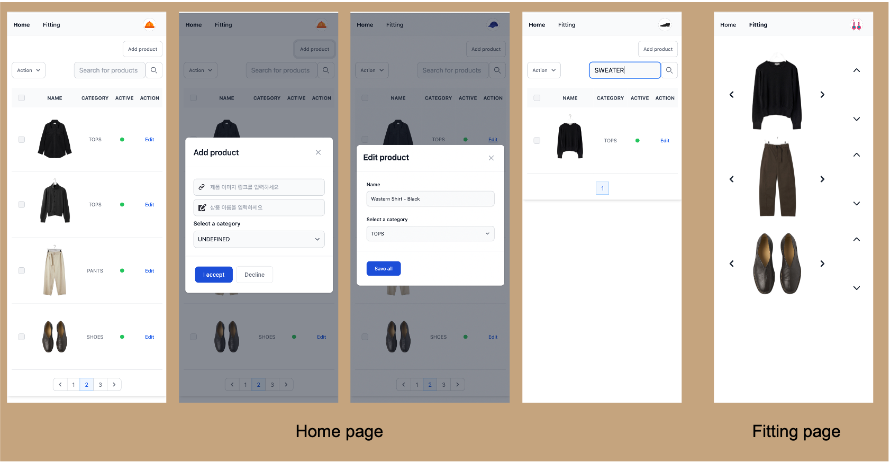

## 과제 설명

### 프로젝트 소개 
- 자신만의 가상의 옷장을 관리하고, 가상 옷장 내부의 옷들을 서로 매칭시켜봅니다.
- 옷 사진의 이미지 url과 자신만의 이름으로 간단하게 옷을 등록할 수 있습니다.

### 서비스 동작 예제


### 기술스택
- API Server: Django DRF, django-spectacular(Swagger), django-query-counter
- Async task: Celery(Distributed Task Queue), Redis(Broker)
- Template: Django MTV, tailwind css
- DB
  - development deploy - sqlite3
  - production deploy - postgresql

### 구동방법
```
# env file 설정
$ cp web/.env.sample .env

# Docker 실행
$ docker-compose up -d && docker-compose logs -f
```