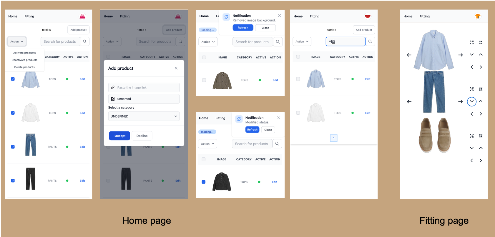
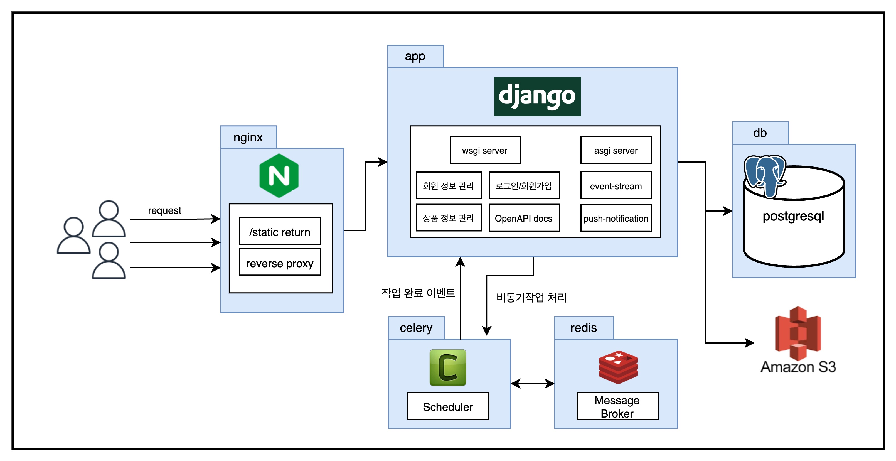

## 프로젝트 설명

### 프로젝트 소개 
- 🛍 간단한 의류 이미지 주소만으로 가상의 옷장에 옷을 등록합니다. 자신만의 가상의 옷장을 관리하고, 가상 옷장 내부의 옷들을 서로 매칭시켜봅니다.
- 👔 현재 상의, 하의, 신발 세개의 카테고리로 매칭이 가능합니다. 각 카테고리 순서대로 Fitting 페이지에서 표시되며 아직 업로드된 의상이 없는 카테고리는 제외됩니다.

### 기술 소개
- 상품 등록 시, `PIL 모듈`과 이미지의 배경을 제거하는 `rembg 모듈`을 사용하여 등록되는 이미지를 다룹니다.
- 상품의 배경이미지는 시간이 소요되므로, 비동기(celery 사용) 작업 완료 시 푸시 알람을 사용하여 작업 완료를 고객에게 알립니다.
- 상품 상태를 수정 및 상품 제거 시에도 푸시 알림을 사용합니다.
- 전체 상품 수가 수정되는 경우, 새로운 상품이 추가되거나 제거되는 경우 Home 페이지의 전체 상품 수를 count할 때 Cache를 사용합니다.

### 이후 개발 계획
- 커뮤니티 기능을 위해 browse 페이지를 구성합니다.  
  (다른 유저가 등록한 대표 이미지 확인 가능, follow / like 가능)
- 다양한 카테고리의 등록 방법을 모색합니다.
- 자동 배포 전략 구성 및 보안정책(SSL) 추가
- 트래픽 발생시에만 서버를 운용할 수 있도록 AWS 작업 수행


### 서비스 동작 예제





### 기술스택
- API Server: Django DRF, django-spectacular(Swagger), django-eventstream, django-query-counter
- Async task: Celery(Distributed Task Queue), Redis(Broker)
- Template: Django MTV, tailwind css
- DB
  - development deploy - sqlite3
  - production deploy - postgresql

### Demo page
- service: [서비스 페이지](http://www.devyam.net/)
- api docs: [swagger ui 페이지](http://www.devyam.net/api/schema/swagger-ui/)

### 구동방법
- `web/.env`의 값들만 채운 후, 아래 명령어를 통해 실행 가능합니다.
- 업로드되는 이미지는 등록한 s3에 저장되므로 s3관련 설정이 필수적입니다.
```
# env file 설정
$ cp web/.env.sample .env

# Docker 실행
$ docker-compose up -d && docker-compose logs -f
```
